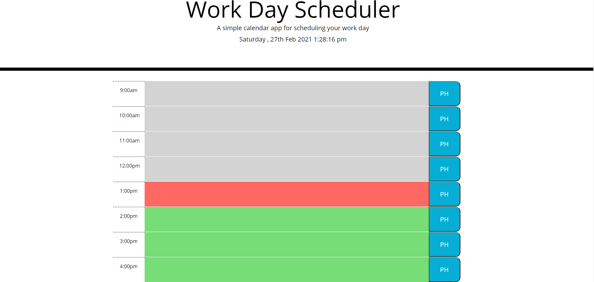

# Work-Schedule

This webpage uses a moment to display the current date and time. 
Then with basic javascript and Jquery, variables are created that will be used in conditional statements for styling.
The scheduler is for working hours 9a - 5p, if the current time is before the time slot you are looking at, that time slot will be green.
If the current time is the same hour as the time slot you're looking at, that time slot will be red.
If the current time is past the time slot you're looking at, the time slot will be grey'ed out. 
You can see this happening in the Javascript - conitional statements. 
Use the blue save button to store the your events in the time slots you want them. Delete the text in the time slot, then hit save again to clear your schedule. 

This webpage was used by taking existing funtions / moment formats and manipulating them to perform the specific task asked of the customer. 

Link to Webpage: https://rutter10.github.io/Work-Schedule/

Screen shot of webpage

